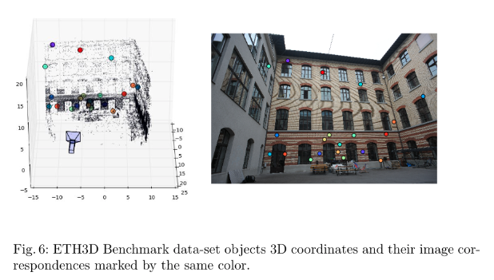
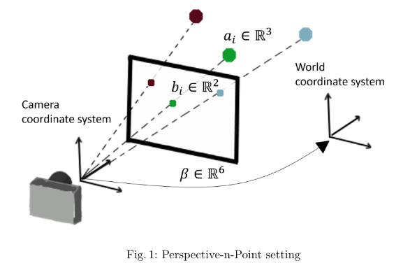
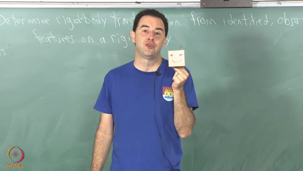
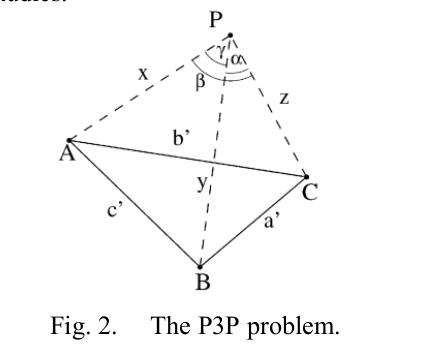
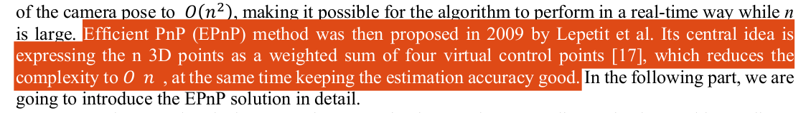

# コンピュータビジョン: PnP問題の基礎


## はじめに

コンピュータビジョンの中で、物体の位置と姿勢を特定するために重要な役割を果たすのが「Perspective-n-Point」問題、通称「PnP問題」です。

> Locating 3D objects from a single RGB image via Perspective-n-Point (PnP) is a long-standing problem in computer vision.
> [EPro-PnP: Generalized End-to-End Probabilistic Perspective-n-Points for Monocular Object Pose Estimation](https://arxiv.org/pdf/2303.12787v2.pdf)より引用
> 訳：
> Perspective-n-Point (PnP) を介して単一の RGB 画像から 3D オブジェクトを見つけることは、コンピューター ビジョンにおける長年の問題です。

> 
> 
> **Introduction:**
> "Camera pose estimation is a fundamental problem that is used in a wide variety of applications such as autonomous driving and augmented reality. 
> The goal of perspective-n-point (PnP) is to estimate the pose parameters of a calibrated camera given the 3D coordinates of a set of objects in the world and their corresponding 2D coordinates in an image that was taken (see Fig. 1). 
> Currently, PnP can be efficiently solved under both accurate and low noise conditions [15,17]. In practice, there may be wrong data associations within the 2D and 3D pairs due to missing objects or incorrect object recognition. Therefore, the main challenge is to develop robust PnP algorithms that are resilient to these imperfections. Identifying outliers is a computationally intensive task which is impractical using classical model based solutions. The goal of this paper is therefore to derive a hybrid approach based on deep learning and classical methods for efficient and robust PnP."
> 
> **日本語訳:**
> "カメラの位置姿勢の推定は、自動運転や拡張現実など、さまざまなアプリケーションで使用される基本的な問題です。
> perspective-n-point（PnP）の目標（ゴール）は、キャリブレーションされたカメラの位置姿勢パラメータを現実世界のオブジェクト3D座標と、それらの対応する2D座標（撮影された画像内で）で推定することす（図1を参照）。
> 現在、PnPは正確で低ノイズの条件下で効率的に解決できます[15,17]。実際には、2Dと3Dのペア内で誤ったデータの関連付けがあるかもしれません。これは、オブジェクトが欠落したり、不正確なオブジェクト認識があるためです。したがって、主要な課題は、これらの不完全さに耐える堅牢なPnPアルゴリズムを開発することです。外れ値を特定することは、古典的なモデルベースの解決策を使用して実用的ではない計算集約的なタスクです。したがって、この論文の目標は、効率的で堅牢なPnPのための深層学習と古典的な方法に基づくハイブリッドアプローチを導くことです。"
> [PnP-Net: A hybrid Perspective-n-Point Network](https://www.semanticscholar.org/reader/9f6c888515e65e0ca50ee5cc38346a4a52a69315)より引用

この記事では、PnP問題とはなにか？から始め、その基本的な概念、そしてPnP問題を解決するための異なるアプローチについて説明します。数学は取り扱いません。

私自身が「PnP問題」を勉強している段階ですので、間違いがあるかもしれません。もし間違いを見つけた場合は、コメントにてご指摘いただけると幸いです。

## PnP問題とは何か？
> "The aim of the Perspective-n-Point problem—PnP in short—is to determine the position and orientation of a camera given its intrinsic parameters and a set of n correspondences between 3D points and their 2D projections. It has many applications in Computer Vision, Robotics, Augmented Reality and has received much attention in both the Photogrammetry (McGlove et al. 2004) and Computer Vision (Hartley and Zisserman 2000) communities. In particular, applications such as feature point-based camera tracking (Skrypnyk and Lowe 2004; Lepetit and Fua 2006) require dealing with hundreds of noisy feature points in real-time, which requires computationally efficient methods."
> 
> [EPnP: An Accurate O(n) Solution to the PnP Problem](https://www.tugraz.at/fileadmin/user_upload/Institute/ICG/Images/team_lepetit/publications/lepetit_ijcv08.pdf)より引用
>
> 訳：
> 「Perspective-n-Point問題」、略して「PnP」とも呼ばれるこの問題の目的は、カメラの位置と姿勢を決定することです。そのためには、カメラの内部パラメータと、3Dポイントとそれらの2D投影との間のn個の対応関係が必要です。これは、コンピュータビジョン、ロボティクス、拡張現実などの多くのアプリケーションで使用されており、写測法（McGlove et al. 2004）およびコンピュータビジョン（Hartley and Zisserman 2000）のコミュニティで多くの注目を集めています。特に、特徴点ベースのカメラトラッキング（Skrypnyk and Lowe 2004; Lepetit and Fua 2006）などのアプリケーションでは、リアルタイムで数百ものノイズのある特徴点を扱う必要があり、計算効率の良い手法が求められます。」

### 参考動画

[Perspective n-point problem](https://www.youtube.com/watch?v=0JGC5hZYCVE&t=1s)(YouTube)

PnPとは、カメラの位置と姿勢（向き）を計算することであり、「問題」というわれる所以は、この計算を効率的かつ正確に行う方法が複数存在するためです。

いかに計算負荷を低くし、正確な近似値を求められるか？、が盛んに研究されています。

自動運転を例にとると、車に積載する**エッジデバイスは計算資源が限られており**、リアルタイムにカメラの位置と姿勢を**正確に**計算する必要があります。

カメラからの2D画像座標と3D空間内の対応する点の座標を使用して、カメラからの画像を正確に3D座標系に変換できれば、カメラの位置と姿勢がわかるため、仮想オブジェクトを正確に配置したり、物体に合わせて表示を調整したりできます。

逆に、カメラが動かない（固定されている）と仮定すれば、カメラからの画像を正確に3D座標系に変換できます。
これにより、撮影対象の物体の位置と姿勢を計算できる、と解釈できます。

応用例は多岐にわたりますが、代表的なものをリストアップします。

- **3Dモデリング**: 物体や環境の3Dモデルを作成する際に、カメラの位置と姿勢を知る必要があります。
- **ロボティクス**: ロボットのセンサーから得られる情報を基に、ロボットの位置と周囲の状況を理解する必要があります。
- **顔認証**: 一部の顔認証システムでは、カメラの位置と姿勢を考慮して顔の3D空間を計算し、3D認証を行います。

PnP問題はこれらのアプリケーションにおいて、物体や顔の位置姿勢を正確に追跡するために不可欠な要素です。この記事では、PnP問題を理解し、解決するための基本的な概念とアプローチについて詳しく説明します。

### 参考文献
- [A Survey on Perspective-n-Point Problem](https://ieeexplore.ieee.org/document/9549863/keywords#keywords)
  - PDFダウンロード不可
- [A Review of Solutions for Perspective-n-Point Problem in Camera Pose
Estimation](https://www.researchgate.net/publication/328036802_A_Review_of_Solutions_for_Perspective-n-Point_Problem_in_Camera_Pose_Estimation/link/5bb42e2d299bf13e605cf55e/download)
  - PDFダウンロード可
- [Perspective-n-Point](https://en.wikipedia.org/wiki/Perspective-n-Point): Wikipedia (en)

### 数学的な概念

PnP問題の数学的背後には、射影変換とトライアングレーションの原則があります。これを理解するために以下の概念が重要です：

1. **射影変換 (Projection Transformation):** カメラは3D空間内の点を2D画像上に射影します。この射影変換は、カメラの内部パラメーター（焦点距離、画像中心の座標など）と外部パラメーター（カメラの位置と姿勢）に依存します。

2. **トライアングレーション (Triangulation):** 2D画像座標と対応する3D空間内の点が複数ある場合、これらの情報を組み合わせてカメラの位置と姿勢を計算する必要があります。トライアングレーションはこのプロセスの一部であり、複数の視点からの情報を統合します。

#### PnP問題の重要性とアプリケーション

PnP問題は、コンピュータビジョン、ロボティクス、拡張現実（AR）、バーチャルリアルチャリティ（VR）など、多くの分野で幅広く使用されます。その重要性とアプリケーションについて以下に示します：

1. **ロボット工学:** ロボットは自己位置推定や障害物検出にPnP問題を活用し、正確な移動や作業を実現します。

2. **拡張現実 (AR):** ARアプリケーションでは、カメラの位置と姿勢をリアルタイムで計算し、仮想オブジェクトを現実世界に重ねて表示します。

3. **バーチャルリアルチャリティ (VR):** VRヘッドセット内のセンサーやカメラを使用して、ユーザーの視点をトラッキングし、没入感を高めます。

4. **自動運転:** 自動運転車は、カメラやセンサーからのデータを基に自車の位置を正確に特定するためにPnP問題を使用します。

PnP問題の理解は、これらの分野で革新的なアプリケーションを開発するための鍵となります。次のセクションでは、PnP問題を解決するためのさまざまなアプローチについて詳しく説明します。


## さまざまな解法
> Related Work
> PnP is a fundamental problem in computer vision and has a long history of parameter estimation methods. We refer the reader to [16] for a comprehensive review. Below, we briefly review the leading algorithms along with their pros and cons.
> 訳：
> PnPはコンピュータビジョンにおける基本的な問題であり、パラメーターの推定方法には長い歴史があります。包括的なレビューは、[16]を参照。以下では、主要なアルゴリズムを簡単に説明し、それらの利点と欠点について触れます。

> [PnP-Net: A hybrid Perspective-n-Point Network](https://www.semanticscholar.org/reader/9f6c888515e65e0ca50ee5cc38346a4a52a69315)より引用


## DLT法（Direct Linear Transform法）
### 参考
[カメラの位置・姿勢推定２　PNP問題　理論編](https://daily-tech.hatenablog.com/entry/2018/01/21/185633)
### 説明:
DLT法は、PnP問題を解決するためのもっとも基本的なアプローチの1つです。
### 長所:
- 比較的単純で理解しやすいアプローチです。

### 短所:
- ノイズに弱く、精度が低い場合があります。

## P3P法
> 
Estimation
> [A Review of Solutions for Perspective-n-Point Problem in Camera Pose Estimation](https://www.researchgate.net/publication/328036802_A_Review_of_Solutions_for_Perspective-n-Point_Problem_in_Camera_Pose_Estimation)より引用
### 説明:
P3P法は、DLT法よりも高い精度を持つPnP問題のアプローチです。この方法では、3つの2D画像座標とそれらに対応する3D空間内の点の座標が必要です。
### 長所:
- 高精度な結果を提供します。誤差に対して頑健です。
- 3つの対応点からカメラの位置と姿勢を計算できます。

### 短所:
- ノイズに弱いとされています。

## EPnP法（Efficient Perspective-n-Point法）

> "Efficient PnP (EPnP) メソッドは、その後2009年にLepetitらによって提案されました。その中心的なアイデアは、n個の3Dポイントを4つの仮想的な制御ポイントの重み付き合計として表現することです [17]。これにより、計算の複雑さをO(n)に削減し、同時に推定の精度を高く保ちます。"
> [A Review of Solutions for Perspective-n-Point Problem in Camera Pose Estimation](https://www.researchgate.net/publication/328036802_A_Review_of_Solutions_for_Perspective-n-Point_Problem_in_Camera_Pose_Estimation)より引用


### 説明:
EPnP法は、PnP問題の高速かつ高精度な解法の1つです。このアプローチは、DLT法とP3P法の一般化であり、N個の2D画像座標とそれに対応する3D空間内の点の座標を使用します。
### 長所:
- 高い精度と柔軟性を提供し、3つ以上の対応点に対応します。
- 結果は誤差に対して頑健です。
### 短所:
- 複雑な最適化アルゴリズムを使用するため、計算が高コストです。

## 深層学習を使用したPnP問題の解決
PnP‑Net、EPro‑PnPなど。
> Driven by end-to-end deep learning, recent studies suggest interpreting PnP as a differentiable layer, allowing for partial learning of 2D-3D point correspondences by backpropagating the gradients of pose loss. Yet, learning the entire correspondences from scratch is highly challenging, particularly for ambiguous pose solutions, where the globally optimal pose is theoretically non-differentiable w.r.t. the points.
> 訳:
エンドツーエンドの深層学習によって推進され、最近の研究ではPnPを微分可能な層として解釈し、姿勢損失の勾配を逆伝播させることによる2D-3Dポイント対応の部分的な学習を可能にすることを提案しています。しかし、最初から対応関係全体を学習することは、曖昧な姿勢解が存在する場合、理論的にはポイントに関してグローバルに最適な姿勢が微分不可能であるため、非常に難しい課題です。
> [EPro-PnP: Generalized End-to-End Probabilistic Perspective-n-Points for Monocular Object Pose Estimation](https://arxiv.org/pdf/2303.12787v2.pdf)より引用

### 短所
- 発展途上
- 計算資源が大きい


## カメラキャリブレーション

### 役割と設定方法

**カメラ内部パラメーター（Intrinsic Parameters）**:
- カメラ内部パラメーターは、カメラの内部特性を定義します。これには以下が含まれます：
  - 焦点距離（f_x、f_y）: レンズの焦点距離は、画像上の物体がどの程度拡大または縮小されるかを示します。
  - 画像中心の座標（c_x、c_y）: 画像の中心点の位置を示します。
  - スキュー（s）: 画像平面が垂直でない場合の歪みを示します。

これらのパラメーターはカメラメーカーやモデルに依存し、通常はキャリブレーションプロセスで推定されます。キャリブレーションは、特定の物体やシーンに対するカメラの歪みを補正するのに役立ちます。

**カメラ外部パラメーター（Extrinsic Parameters）**:
- カメラ外部パラメーターは、カメラの位置と姿勢を定義します。これには以下が含まれます：
  - カメラの位置（Translation vector）: カメラの原点から対象物体への距離と向きを示します。
  - カメラの姿勢（Rotation vector or matrix）: カメラの向きを示し、物体に対するカメラの回転を定義します。

これらのパラメーターは、カメラが撮影した画像における物体の位置と姿勢を計算するのに使用されます。

### カメラ行列（Camera Matrix）と歪み係数（Distortion Coefficients）

**カメラ行列**:
- カメラ行列（A）はカメラの内部パラメーターを1つの行列にまとめたものです。一般的に以下のように表されます：

  ```
  A = | f_x   s   c_x |
      |  0   f_y  c_y |
      |  0    0    1  |
  ```

  ここで、f_x、f_yは焦点距離、c_x、c_yは画像中心の座標、sはスキューを表します。

**歪み係数**:
- 歪み係数は、カメラレンズによる歪みをモデル化するためのパラメーターです。主に2つのタイプがあります：
  - 放射状歪み（Radial Distortion）: レンズが円形でないために生じる歪みを示します。
  - 切断歪み（Tangential Distortion）: レンズの平面が平行でないために生じる歪みを示します。

  歪み係数は通常k1、k2、p1、p2、k3などの係数で表され、これらの係数はカメラキャリブレーションによって推定されます。


## PythonとPyTorchを使用したPnP問題の基本的な実装

まず、PythonとPyTorchを使用してPnP問題を解決する基本的な実装例を示します。この例では、EPnP法を使用します。

```python
import torch
import cv2
import numpy as np

# 2D画像座標と3D空間内の点の対応データ
image_points = torch.tensor([[x, y] for x in range(10) for y in range(10)], dtype=torch.float32)
world_points = torch.tensor([[x, y, 0] for x in range(10) for y in range(10)], dtype=torch.float32)

# カメラ内部パラメーター (カメラ行列)
fx = 1000.0  # 焦点距離 (f_x)
fy = 1000.0  # 焦点距離 (f_y)
cx = 320.0   # 画像中心のx座標
cy = 240.0   # 画像中心のy座標

camera_matrix = torch.tensor([[fx, 0, cx],
                              [0, fy, cy],
                              [0, 0, 1]], dtype=torch.float32)

# EPnPアルゴリズムを使用してカメラの位置と姿勢を計算
_, rvec, tvec, _ = cv2.solvePnPRansac(world_points.numpy(), image_points.numpy(), camera_matrix.numpy(), None)

# rvecは回転ベクトル、tvecは移動ベクトル
print("Rotation Vector (rvec):", rvec)
print("Translation Vector (tvec):", tvec)
```

このコード例では、PyTorchを使用して2D画像座標と3D空間内の点の対応データを定義し、カメラ内部パラメーター（カメラ行列）を設定します。そして、OpenCVの`solvePnPRansac`関数を使用して、カメラの位置と姿勢を計算します。計算結果は回転ベクトル（rvec）と移動ベクトル（tvec）として得られます。

## OpenCVを使用したカメラの位置と姿勢の計算デモ

次に、OpenCVを使用してカメラの位置と姿勢を計算するデモを示します。このデモでは、実際のカメラを使用してカメラキャリブレーションを行い、そのキャリブレーションデータを使用して位置と姿勢を計算します。以下はデモの概要です。

```python
import cv2

# カメラキャリブレーション
criteria = (cv2.TERM_CRITERIA_EPS + cv2.TERM_CRITERIA_MAX_ITER, 30, 0.001)
objp = np.zeros((6 * 9, 3), np.float32)
objp[:, :2] = np.mgrid[0:9, 0:6].T.reshape(-1, 2)

objpoints = []  # 3Dオブジェクト点
imgpoints = []  # 2Dイメージ点

# キャリブレーション用の画像データを収集し、objpointsとimgpointsを埋めます

# キャリブレーション
ret, mtx, dist, rvecs, tvecs = cv2.calibrateCamera(objpoints, imgpoints, gray.shape[::-1], None, None)

# カメラ位置と姿勢の計算
rotation_vector, translation_vector = rvecs[0], tvecs[0]

print("Rotation Vector:", rotation_vector)
print("Translation Vector:", translation_vector)
```

このデモでは、`cv2.calibrateCamera`関数を使用してカメラの内部パラメーターと歪み係数をキャリブレーションし、それを元にカメラの位置と姿勢を計算します。

## 参考文献
**学術論文:**

1. Lepetit, V., Moreno-Noguer, F., & Fua, P. (2009). EPnP: An accurate O (n) solution to the PnP problem. International Journal of Computer Vision, 81(2), 155-166.

2. Zhang, Z. (2000). A flexible new technique for camera calibration. IEEE Transactions on Pattern Analysis and Machine Intelligence, 22(11), 1330-1334.

3. Fischler, M. A., & Bolles, R. C. (1981). Random sample consensus: A paradigm for model fitting with applications to image analysis and automated cartography. Communications of the ACM, 24(6), 381-395.

**書籍:**

1. Hartley, R., & Zisserman, A. (2004). Multiple View Geometry in Computer Vision. Cambridge University Press. - カメラキャリブレーションやPnP問題に関する包括的な書籍。

2. Trucco, E., & Verri, A. (1998). Introductory Techniques for 3-D Computer Vision. Prentice-Hall. - 3Dコンピュータビジョンの基本的な技術とアルゴリズムを解説。

**オンラインリソース:**

1. OpenCVドキュメンテーション: [OpenCV Documentation](https://docs.opencv.org/) - OpenCVライブラリを使用したPnP問題の実装に関する詳細な情報が含まれています。

2. GitHubのコードリポジトリ: [GitHub](https://github.com/) - PnP問題のサンプルコードや関連プロジェクトがGitHub上で利用可能です。特定のアルゴリズムやライブラリに関心がある場合、GitHubを検索してみてください。

3. オンラインコース: オンライン教育プラットフォーム（Coursera、Udacity、edXなど）では、コンピュータビジョンや3D計測に関するコースが提供されています。これらのコースはPnP問題の理解と実装に役立つでしょう。

## まとめ

この記事では、コンピュータビジョン分野における重要なトピックである「PnP問題」について詳しく説明しました。以下に、本記事の要点をまとめます。

1. **PnP問題の概要**: PnP（Perspective-n-Point）問題は、カメラからの2D画像座標と3D空間内の対応する点の座標を使用して、カメラの位置と姿勢を計算する問題です。この問題はコンピュータビジョンやロボティクスの分野で広く使用されています。

2. **PnP問題の重要性**: PnP問題の解決は、3Dモデリング、ロボティクス、顔認証などのアプリケーションにおいて不可欠です。物体や顔の位置姿勢を正確に追跡するために使用されます。

3. **PnP問題の基本的な数学的概念**: PnP問題の解決には、カメラの内部パラメーター（カメラ行列）と2D-3D対応データが必要です。アプローチにはDLT法、P3P法、EPnP法などがあります。

4. **カメラキャリブレーション**: カメラの内部パラメーターを正確に知るために、カメラキャリブレーションが重要です。キャリブレーションデータを収集し、カメラ行列と歪み係数を計算します。

5. **PythonとOpenCVを使用した実装**: PythonとOpenCVを使用してPnP問題を解決する基本的な実装例を提供しました。EPnP法を使用したカメラの位置と姿勢の計算方法を紹介しました。

PnP問題はコンピュータビジョン分野において基本的なトピックであり、実世界のアプリケーションに広く適用されています。これを理解し、実装することで、画像処理と3Dモデリングにおける精度と効率を向上させることができます。 PN P問題に興味を持ったら、さらに学習と実践を進めて、コンピュータビジョンの専門家としてのスキルを発展させていきましょう。